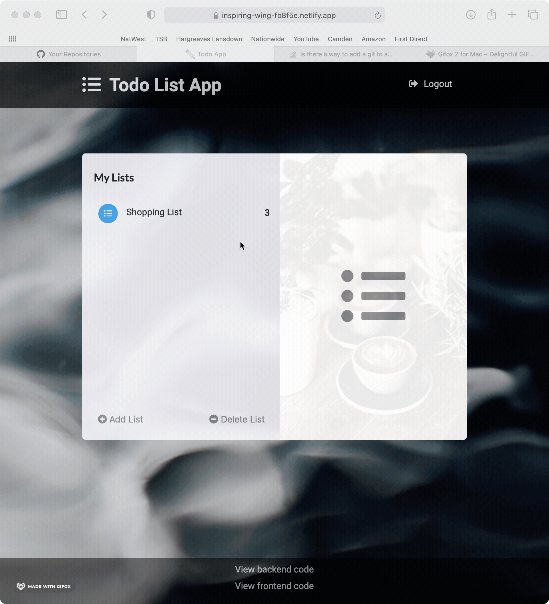

# Todo List app

A simple todo app built using Rails 6 as a backend Api together with a frontend app using react/redux

The backend uses postgres as database with 3 models, a todo a list item and a user. Tested with Rspec and deployed to heroku. The front end connects with axios and uses redux for state management.

Front end published on Netlify
https://inspiring-wing-fb8f5e.netlify.app/auth

Backend code build in rails as api
https://github.com/Lucx14/todo-backend-r

## Demo

